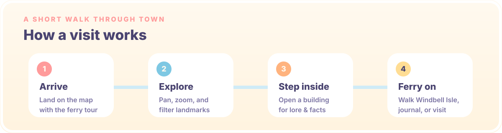

<p align="center">
  <a href="./README.md"></a>
  &nbsp;
  <a href="./README.zh-CN.md"></a>
</p>

<p align="center">
  
</p>

<p align="center">
  <a href="https://summertown.summercommences.com/"><strong>Visit the live town →</strong></a>
  &nbsp;·&nbsp;
  <a href="https://github.com/summerpapaya/summertown">GitHub</a>
</p>

---

Welcome to Summer Town! **Summer Town** is an interactive map of a tiny seaside place. Pan across the waterfront, click into fourteen landmarks, change the time of day, take the ferry tour, then wander Windbell Isle, the town journal, and a visit guide.

<p align="center">
  
</p>

<p align="center">
  
</p>

### What you can do on the map

- **Start exploring** or **take the ferry tour** from the arrival screen
- **Pan and zoom** the isometric town (world canvas: 2400 × 1680)
- **Open landmarks** for scenes, lore, and sticky facts
- **Filter** by Culture, Food, Stay, Magic, or Isle
- **Repaint the sky** with Day, Golden Hour, or Starlight

| Landmark | Chip |
| --- | --- |
| Town Hall & Central Garden | Heart of Town |
| The Seashell Theater | Culture |
| The Gullwing Livehouse | Culture · Night |
| Nook & Cranny General Store | Food & Goods |
| The Pearl Gallery | Culture |
| Café Seabreeze | Food |
| Summer FM 105.5 | On Air |
| The Tidepool Library | Culture |
| Paper Boat Design Lab | Make |
| The Apple Cottage | Food · Home |
| The Magic House | Magic |
| Hotel Horizon | Stay |
| The Three Villas | Stay |
| Windbell Isle | Isle |

Deep links work with `?place=<id>` (for example `?place=coffee`).

<p align="center">
  
</p>

<p align="center">
  
</p>

### Routes beyond the map

| Route | What it is |
| --- | --- |
| [`/`](https://summertown.summercommences.com/) | Interactive town map + field notes |
| [`/windbell-isle`](https://summertown.summercommences.com/windbell-isle) | Scroll journey: pier → meadow → pavilion → sunset → lighthouse |
| [`/journal`](https://summertown.summercommences.com/journal) | Passport index, town calendar, postcard wall |
| [`/visit`](https://summertown.summercommences.com/visit) | Ferry timetable, stays, etiquette, packing list |

<p align="center">
  
</p>

### Open it

**Live**

[summertown.summercommences.com](https://summertown.summercommences.com/)

**Local**

```bash
npm install
npm run dev
```

Then open the Vite URL printed in the terminal.

```bash
npm run build    # production build → dist/
npm run preview  # preview the production build
npm run lint     # eslint
```

### Stack

React 19 · TypeScript · Vite · Tailwind CSS · Framer Motion · GSAP · Lenis · Howler · shadcn/ui

Deployed to GitHub Pages from `main` via `.github/workflows/deploy.yml` (custom domain: `summertown.summercommences.com`).

### Made with

- Vibe coding: [Kimi K3 Swarm](https://www.kimi.com/)
- README writing: Cursor Grok 4.5
- README design: [beautify-github-readme](https://github.com/oil-oil/beautify-github-readme)

### Notes

- Best experienced with a mouse or trackpad (custom cursor + map gestures).
- Sound can be toggled from the navbar; respect your own volume.
- Map art, landmark cutouts, and scenes are original project assets — please don’t reuse them without permission.