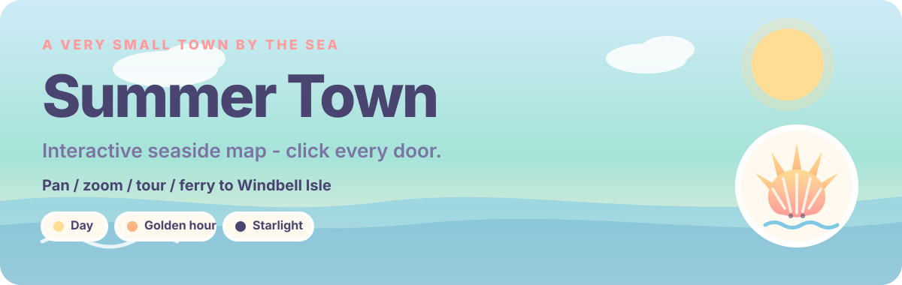
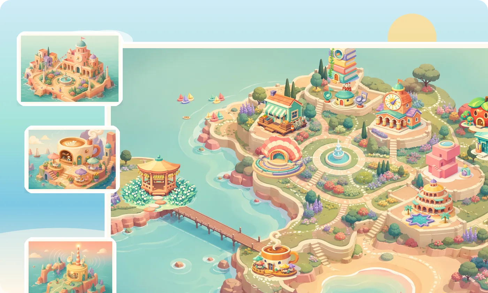
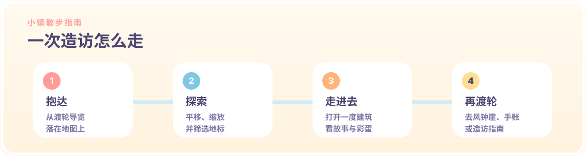

<p align="center">
  <a href="./README.md"></a>
  &nbsp;
  <a href="./README.zh-CN.md"></a>
</p>

<p align="center">
  
</p>

<p align="center">
  <a href="https://summertown.summercommences.com/"><strong>访问线上小镇 →</strong></a>
  &nbsp;·&nbsp;
  <a href="https://github.com/summerpapaya/summertown">GitHub</a>
</p>

---

欢迎来到夏天镇！**Summer Town** 是一座（虚拟的）海边小镇的互动地图。沿水岸平移，浏览十四处地标，切换一天里的光影变化，乘坐渡轮导览，再去看看风铃屿、小镇手账和造访指南。

<p align="center">
  
</p>

<p align="center">
  
</p>

### 在地图上可以做什么

- 从抵达画面 **开始探索**，或 **乘坐渡轮导览**
- **平移与缩放** 等距小镇（世界画布：2400 × 1680）
- **打开地标**，查看场景、故事与贴纸式彩蛋
- 按 **文化 / 美食 / 住宿 / 魔法 / 小岛** 筛选
- 用 **日间 / 黄金时刻 / 星光** 重绘天空

| 地标 | 标签 |
| --- | --- |
| 市政厅与中央花园 | 小镇之心 |
| 海螺剧场 | 文化 |
| 鸥翼 Livehouse | 文化 · 夜间 |
| 犄角旮旯杂货铺 | 美食与杂货 |
| 珍珠画廊 | 文化 |
| 海风咖啡馆 | 美食 |
| Summer FM 105.5 | 正在播出 |
| 潮池图书馆 | 文化 |
| 纸船设计工坊 | 制作 |
| 苹果屋 | 美食 · 家 |
| 魔法屋 | 魔法 |
| 地平线酒店 | 住宿 |
| 三栋别墅 | 住宿 |
| 风铃屿 | 小岛 |

深链接可用 `?place=<id>`（例如 `?place=coffee`）。

<p align="center">
  
</p>

<p align="center">
  
</p>

### 地图之外的路线

| 路线 | 内容 |
| --- | --- |
| [`/`](https://summertown.summercommences.com/) | 互动小镇地图 + 田野笔记 |
| [`/windbell-isle`](https://summertown.summercommences.com/windbell-isle) | 滚动旅程：长栈桥 → 铃兰草地 → 风铃亭 → 日落点 → 灯塔 |
| [`/journal`](https://summertown.summercommences.com/journal) | 护照索引、小镇日历、明信片墙 |
| [`/visit`](https://summertown.summercommences.com/visit) | 渡轮时刻表、住宿、礼仪、打包清单 |

<p align="center">
  
</p>

### 访问

**线上**

[summertown.summercommences.com](https://summertown.summercommences.com/)

**本地**

```bash
npm install
npm run dev
```

然后打开终端里打印的 Vite 地址。

```bash
npm run build    # 生产构建 → dist/
npm run preview  # 预览生产构建
npm run lint     # eslint
```

### 技术栈

React 19 · TypeScript · Vite · Tailwind CSS · Framer Motion · GSAP · Lenis · Howler · shadcn/ui

通过 `.github/workflows/deploy.yml` 从 `main` 部署到 GitHub Pages（自定义域名：`summertown.summercommences.com`）。

### 制作工具

- 氛围编程（vibe coding）：[Kimi K3 Swarm](https://www.kimi.com/)
- README 文案：Cursor Grok 4.5
- README 设计：[beautify-github-readme](https://github.com/oil-oil/beautify-github-readme)

### 说明

- 更适合鼠标或触控板（自定义光标 + 地图手势）。
- 声音可在导航栏开关；请自行控制音量。

### 许可

- **源代码** 采用 [MIT License](./LICENSE) 发布。
- **原创美术与品牌素材**（`public/` 下的地图、地标切图、场景图、logo、光标及相关图像）为 **© 2026 SummerPapaya，保留所有权利**。详见 [NOTICE](./NOTICE)。

未经许可，请勿转用上述美术素材。